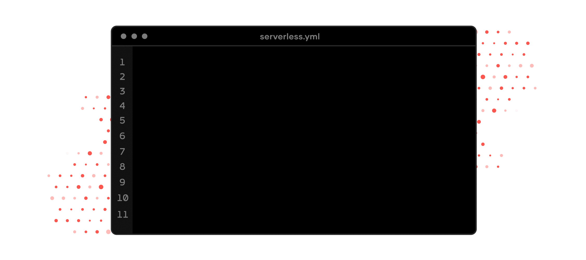
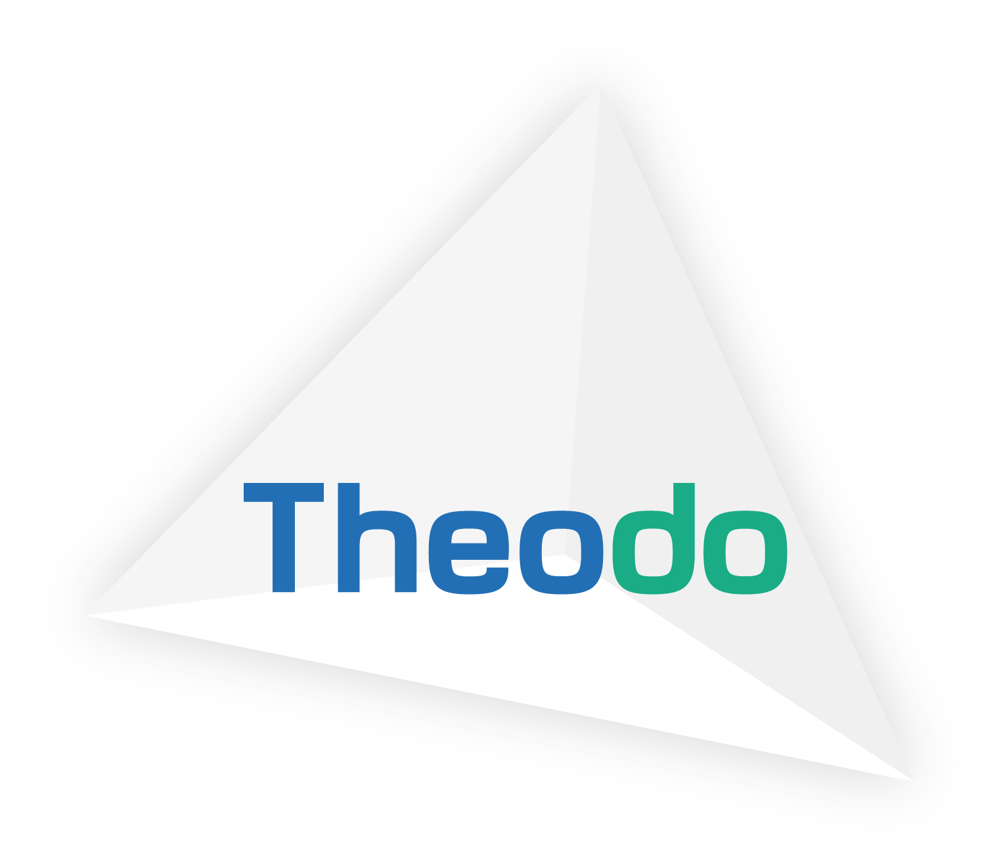
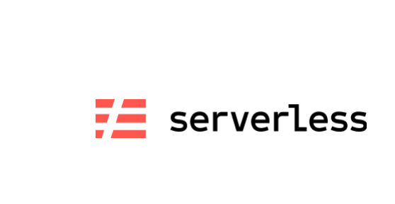

Lift is a plugin that leverages the AWS CDK to expand the [Serverless Framework](https://www.serverless.com/) beyond functions.

Deploy production-ready websites, queues, storage buckets and more with a few lines in serverless.yml.

- ⚡️ **For developers** - No AWS knowledge required
- ⚡️ **Production-ready** - Built by AWS experts, optimized for production
- ⚡️ **Not invasive** - Integrates with existing projects
- ⚡️ **No lock-in** - Eject to CloudFormation at any time

[Why Lift?](docs/comparison.md)

## Installation

Lift is a [Serverless Framework plugin](https://www.serverless.com/plugins/), install it in your project:

```bash
serverless plugin install -n serverless-lift
```

> If you prefer, you can install Lift via NPM: `npm install --save-dev serverless-lift`. Then, register the `serverless-lift` plugin in `serverless.yml` (see the example below).

## Quick start

Once installed, start using Lift constructs in `serverless.yml`:

```yaml
service: my-app

provider:
    name: aws

plugins:
    - serverless-lift

functions:
    # ...

constructs:

    # Include Lift constructs here

    landing-page:
        type: static-website
        path: 'landing/dist'

    avatars:
        type: storage
```

## Constructs

The [AWS CDK](https://docs.aws.amazon.com/cdk/latest/guide/home.html) is extremely powerful, but it is very complex and cannot be used in `serverless.yml`. Lift changes that: use the best of the CDK in Serverless, without having to learn about it!

Lift provides components, aka "**constructs**", specifically selected for serverless applications. They are all built using the CDK and its best practices, with unique features to provide an awesome developer experience.

### [Single page app](docs/single-page-app.md)

Deploy single-page applications, for example React, VueJS or Angular apps.

```yaml
constructs:
    landing:
        type: single-page-app
        path: dist
```

[Read more...](docs/single-page-app.md)

### [Static website](docs/static-website.md)

Deploy static websites.

```yaml
constructs:
    landing:
        type: static-website
        path: dist
```

[Read more...](docs/static-website.md)

### [Storage](docs/storage.md)

Deploy preconfigured S3 buckets to store files.

```yaml
constructs:
    avatars:
        type: storage
```

[Read more...](docs/storage.md)

### [Queue](docs/queue.md)

Deploy SQS queues and workers for asynchronous processing.

```yaml
constructs:
    my-queue:
        type: queue
        worker:
            handler: src/report-generator.handler
```

[Read more...](docs/queue.md)

### [Webhook](docs/webhook.md)

Deploy webhooks to receive notifications from 3rd party applications.

```yaml
constructs:
    stripe-webhook:
        type: webhook
        path: /my-webhook-endpoint
        authorizer:
            handler: myAuthorizer.main
```

[Read more...](docs/webhook.md)

### [Database - DynamoDB Single Table](docs/database-dynamodb-single-table.md)

Deploy databases leveraging DynamoDB Single Table Design principles.

```yaml
constructs:
    database:
        type: database/dynamodb-single-table
```

### [Server-side website](docs/server-side-website.md)

Deploy server-side rendered websites, for example Laravel or Symfony apps.

```yaml
constructs:
    website:
        type: server-side-website
        assets:
            '/css/*': public/css
            '/js/*': public/js
```

[Read more...](docs/server-side-website.md)

More constructs are coming soon! Got suggestions? [Open and upvote drafts](https://github.com/getlift/lift/discussions/categories/constructs).

## Lift-specific configuration

Lift default behaviors can be override and configured as per your likings using the `lift` property at the root of your `serverless.yml` file. This property is optional as well as all the [configurable options within](docs/configuration.md). Configurations specified at this level affect all constructs defined within the same service file.

## Ejecting

You can eject from Lift at any time: Lift is based on CloudFormation. That allows anyone to kickstart a project with Lift, and fallback to CloudFormation if you ever grow out of it.

To eject:

- export the CloudFormation template via `serverless lift eject`
- copy the parts you want to turn into CloudFormation and paste them in the [`resources` section of serverless.yml](https://www.serverless.com/framework/docs/providers/aws/guide/resources/)
- don't forget to remove from `serverless.yml` the Lift constructs you have turned into CloudFormation

## Extend Lift constructs

Lift packages production-ready features in the form of highly opinionated construts with minimal configuration options in order to avoid confusion for serverless early adopters. In order to empower more advanced developpers, every construct ships with an `extensions` property allowing overrides on the underlying Cloudformation Resources.

In the exemple below, the S3 Bucket CloudFormation Resource generated by the `avatars` storage construct will be extened with the new `AccessControl: PublicRead` CloudFormation property.

```yaml
constructs:
    avatars:
        type: storage
        extensions:
            bucket:
                Properties:
                    AccessControl: PublicRead
```

Each construct documentation lists available underlying CloudFormation resources that can be extended using the `extensions` key.

## TypeScript definitions

TypeScript users can use `serverless.ts` instead of `serverless.yml`. Lift provides [type definitions to help](docs/serverless-types.md).

---

Lift is built and maintained with love ❤️ by

<a href="https://www.theodo.fr/" title="Theodo"></a>
<a href="https://www.serverless.com/" title="Serverless"></a>
