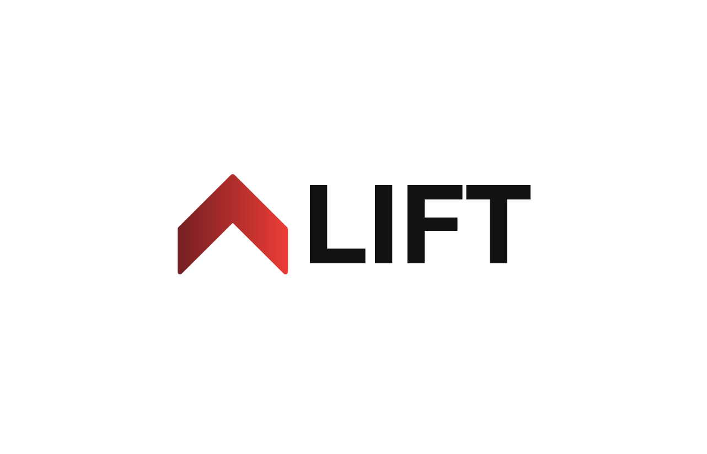
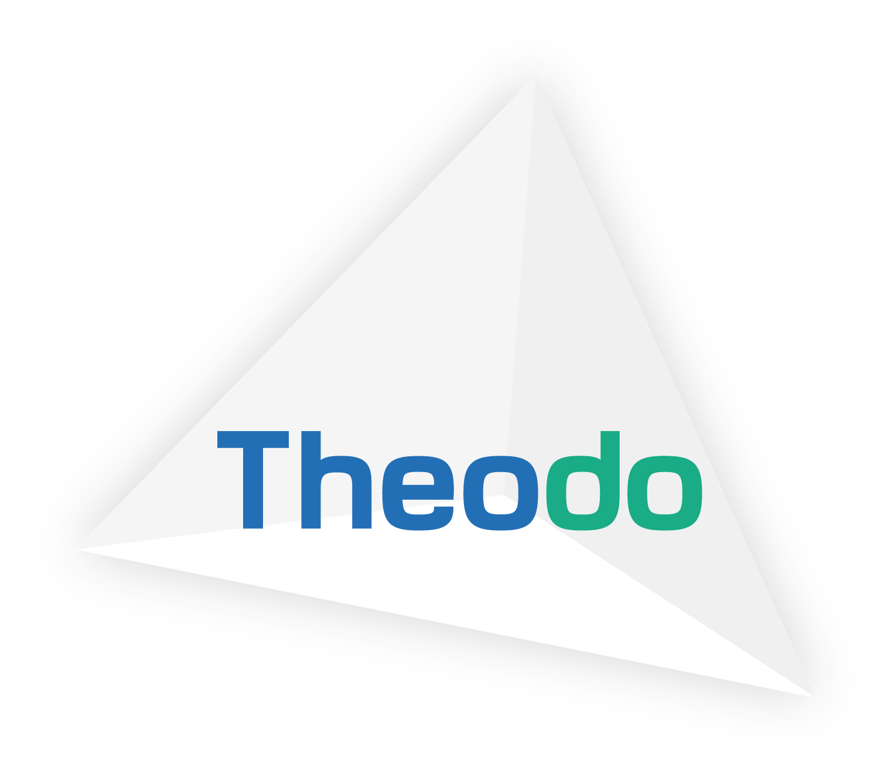
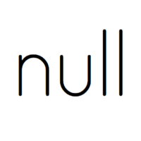

*Shipping Serverless features made easy*

> 🚧 The project is currently a **work in progress**, expect a first beta in May.

## Features

Lift packages well-architected AWS serverless features. It is made both for developers whitout any prior serverless experience, as well as for experienced AWS builders.

- 🌐 **Allows non-serverless developers to dive in** - Developer oriented vocabulary, no AWS services knowledge required
- 📦 **Increases delivery speed** - Production-ready serverless components with minimal required configuration
- 🔁 **Leverages your existing serverless project** - Integrates with existing Serverless framework project
- ⏏️ **Does not lock you in** - Ejectable to CloudFormation at any time

[Why should I choose Lift ?](docs/comparison.md)

## Quick start

*serverless.yml*
```yaml
service: my-app

provider:
    name: aws

static-website:
    landing-page:
        domain: mywebsite.com

storage:
    assets:
        encrypted: true
```

## What is Lift ?

Lift is a [Serverless](https://www.serverless.com/) plugin that simplifies deploying well-designed serverless applications.

Stay updated by *Watching* the repository on GitHub.

## Components

### Static Website

Deploying static websites and single-page applications, for example React, VueJS or Angular apps.

[Get involved in the static website component internal design and interface](https://github.com/getlift/lift/discussions/5)

---

## Lift is built and maintened with love ❤️ by

<a href="https://www.theodo.fr/" title="Theodo"></a>
<a href="https://null.tc/" title="null"></a>
