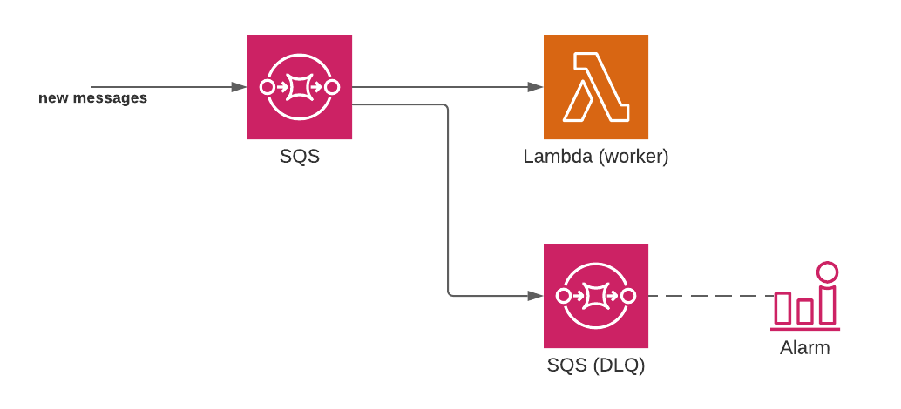

# Queues

Some tasks are too long to be processed synchronously. Instead, they can be processed in the background via a job queue and worker.

The `queues` component deploys a properly configured **SQS queue** with a **worker running on AWS Lambda**.

## Quick start

```yaml
service: my-app
provider:
  name: aws

queues:
  my-queue:
    worker:
      handler: src/report-generator.handler

plugins:
    - serverless-lift
```

On `serverless deploy`, a `my-queue` queue will be created, and a Lambda function will be deployed to process jobs (aka "messages") from the queue.

## How it works

The `queues` component deploys the following resources:

- An SQS queue: this is where jobs to process should be sent.
- A "worker" Lambda function: this function will be processing each job sent to the SQS queue.
- An SQS "[Dead Letter Queue](https://docs.aws.amazon.com/AWSSimpleQueueService/latest/SQSDeveloperGuide/sqs-dead-letter-queues.html)": this queue will contain all the jobs that failed to be processed.
- Optionally, a CloudWatch alarm that sends an email if jobs land in the Dead Letter Queue.

To learn more about the architecture of this component, [read this article](https://medium.com/serverless-transformation/serverless-queues-and-workers-designing-lift-d870afdba867).



## Variables

All queue components expose the following variables:

- `queueUrl`: the URL of the deployed SQS queue
- `queueArn`: the ARN of the deployed SQS queue

This can be used to reference the queue from other Lambda functions, for example:

```yaml
queues:
  my-queue:
    # ...

functions:
  otherFunction:
      handler: src/publisher.handler
      environment:
        QUEUE_URL: ${queues:my-queue.queueUrl}
```

_Note: the `${queues:my-queue.queueUrl}` variable will automatically be replaced with a CloudFormation reference to the SQS queue._

## Configuration reference

### Worker

```yaml
queues:
  my-queue:
    worker:
      # The Lambda function is configured here
      handler: src/report-generator.handler
```

_Note: the Lambda "worker" function is configured in the `queues` component, instead of being defined in the `functions` section._

The only required setting is the `handler`: this should point to the code that handles SQS messages. The handler [should be written to handle SQS events](https://docs.aws.amazon.com/lambda/latest/dg/with-sqs.html), for example in JavaScript:

```js
exports.handler = async function(event, context) {
    event.Records.forEach(record => {
        // `record` contains the job that was pushed to SQS
    });
}
```

[All settings allowed for functions](https://www.serverless.com/framework/docs/providers/aws/guide/functions/) can be used under the `worker` key. For example:

```yaml
queues:
  my-queue:
    worker:
      handler: src/report-generator.handler
      memorySize: 512
      timeout: 10
```

_Note: Lift will automatically configure the function to be triggered by SQS. It is not necessary to define `events` on the function._

### Alarm

```yaml
queues:
  my-queue:
    # ...
    alarm: alerting@mycompany.com
```

It is possible to configure email alerts in case jobs end up in the dead letter queue.

After the first deployment, an email will be sent to the email address to confirm the subscription.

### Retries

```yaml
queues:
  my-queue:
    # ...
    maxRetries: 5
```

*Default: 3 retries.*

The `maxRetries` option configures how many times each job will be retried when failing.

If the job still fails after reaching the max retry count, it will be moved to the dead letter queue for storage.

### Retry delay

When Lambda fails processing a SQS job (i.e. the code throws an error), the job will be retried after a delay. That delay is also called "**Visibility Timeout"** in SQS.

By default, Lift configures the retry delay to 6 times the worker functions timeout, [per AWS' recommendation](https://docs.aws.amazon.com/lambda/latest/dg/with-sqs.html#events-sqs-queueconfig). Since Serverless deploy functions with a timeout of 6 seconds by default, that means that jobs will be retried every 36 seconds.

When the function's timeout is changed, the retry delay is configured accordingly:

```yaml
queues:
  my-queue:
    # ...
    worker:
      handler: src/report-generator.handler
      # We change the timeout to 10 seconds
      timeout: 10
      # The retry delay on the queue will be 10*6 => 60 seconds
```

### Batch size

```yaml
queues:
  my-queue:
    # ...
    batchSize: 5 # Lambda will receive 5 messages at a time
```

*Default: 1*

When the SQS queue contains more than 1 job to process, it can invoke Lambda with a batch of multiple messages at once.

By default, Lambda will be invoked 1 messages at a time. The reason is to simplify error handling: in a batch, any failed message will fail the whole batch.

It is possible to change the batch size between 1 and 10.

### More options

Looking for more options in the component configuration? [Open a GitHub issue](https://github.com/getlift/lift/issues/new).
