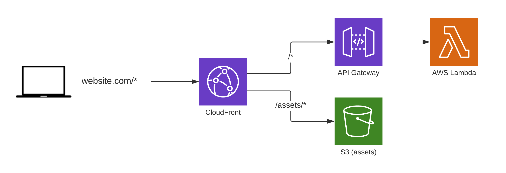

# Server-side website

The `server-side-website` construct deploys websites where the HTML is rendered "server-side", i.e. on AWS Lambda.

This is usually done with backend frameworks like Laravel/Symfony (PHP), Ruby on Rails, Django/Flask (Python), Express (Node), etc.

To build a SPA or static website, use the [Static Website construct](static-website.md) instead.

## Quick start

```yaml
service: my-app
provider:
    name: aws

functions:
    home:
        handler: home.handler
        events:
            -   httpApi: 'GET /'
    # ...

constructs:
    website:
        type: server-side-website
        assets:
            '/css/*': public/css
            '/js/*': public/js

plugins:
    - serverless-lift
```

On `serverless deploy`, the example above will set up a website that serves both:

- `https://<domain>/*` -> the website through API Gateway + Lambda
- `https://<domain>/css/*` and `https://<domain>/js/*` -> assets through S3

_Note: **the first deployment takes 5 minutes**._

The website is served over HTTPS and cached all over the world via the CloudFront CDN.

## How it works



On the first `serverless deploy`, Lift creates:

- an [S3](https://aws.amazon.com/s3/) bucket to serve static assets (CSS, JS, etc.)
- a [CloudFront CDN](https://aws.amazon.com/cloudfront/)

CloudFront serves the website over HTTPS with caching at the edge. It also provides an "HTTP to HTTPS" redirection which is not supported by API Gateway. For websites, this is problematic because it means someone typing `website.com` in a browser will get a blank page: API Gateway will not even redirect this to HTTPS.

Finally, CloudFront also acts as a router:

- URLs that points to static assets are served by S3
- all the other URLs are served by API Gateway

The construct uses the API Gateway configured in functions defined in `serverless.yml`.

Additionally, every time `serverless deploy` runs, Lift:

- uploads the static assets to the S3 bucket
- invalidates the CloudFront CDN cache

_Note: the S3 bucket is public and entirely managed by Lift. Do not store or upload files to the bucket, they will be removed by Lift on the next deployment. Instead, create a separate bucket to store any extra file._

### CloudFront configuration

CloudFront is configured to cache static assets by default, but not cache dynamic content by default. It will forward cookies, query strings and most headers to the backend running on Lambda.

## Website routes

To define website routes, create Lambda functions in `functions:` [with `httpApi` events](https://www.serverless.com/framework/docs/providers/aws/events/http-api/):

```yaml
# serverless.yml
# ...

functions:
    home:
        handler: home.handler
        events:
            -   httpApi: 'GET /'
    search:
        handler: search.handler
        events:
            -   httpApi: 'GET /search'
    # ...

constructs:
    website:
        type: server-side-website
        # ...
```

Check out [the official documentation](https://www.serverless.com/framework/docs/providers/aws/events/http-api/) on how to set up HTTP events.

When using backend frameworks that provide a routing feature, another option is to define a single Lambda function that captures all the HTTP routes:

```yaml
# serverless.yml
# ...

functions:
    backend:
        handler: index.handler
        events:
            -   httpApi: '*'

constructs:
    website:
        type: server-side-website
        # ...
```

## Variables

The `server-side-website` construct exposes the following variables:

- `url`: the URL of the deployed website (either the CloudFront URL or the first custom domain, if configured)

For example:

```yaml
constructs:
    website:
        type: server-side-website
        # ...

functions:
    backend:
        # ...
        environment:
            WEBSITE_URL: ${construct:website.url}
```

_How it works: the `${construct:website.url}` variable will automatically be replaced with a CloudFormation reference._

- `cname`: the CloudFront domain to point custom domains to, for example `d1111abcdef8.cloudfront.net`

This can be used to configure a custom domain with Route53, for example:

```yaml
constructs:
    website:
        type: server-side-website
        # ...
resources:
    Resources:
        Route53Record:
            Type: AWS::Route53::RecordSet
            Properties:
                HostedZoneId: ZXXXXXXXXXXXXXXXXXXJ # Your HostedZoneId
                Name: app.mydomain
                Type: A
                AliasTarget:
                    HostedZoneId: Z2FDTNDATAQYW2 # Cloudfront Route53 HostedZoneId. This does not change.
                    DNSName: ${construct:website.cname}
```

## Commands

`serverless deploy` deploys everything configured in `serverless.yml` and uploads assets.

When iterating, it is possible to skip the CloudFormation deployment and directly publish changes via:

- `serverless deploy function -f <function-name>` to deploy a single Lambda function
- `serverless <construct-name>:assets:upload` to upload assets to S3 (the CloudFront cache will be cleared as well)

## Configuration reference

### Assets

```yaml
constructs:
    website:
        # ...
        assets:
            '/assets/*': dist/
```

The `assets` section lets users define routing for static assets (like JavaScript, CSS, images, etc.).

- The key defines **the URL pattern**.
- The value defines **the local path to upload**.

Assets can be either whole directories, or single files:

```yaml
constructs:
    website:
        # ...
        assets:
            # Directories: routes must end with `/*`
            '/css/*': dist/css
            '/images/*': assets/animations
            # Files:
            '/favicon.ico': public/favicon.ico
```

With the example above:

- `https://<domain>/*` -> Lambda
- `https://<domain>/css/*` -> serves the files uploaded from the local `dist/css` directory
- `https://<domain>/images/*` -> serves the files uploaded from the local `assets/animations` directory
- `https://<domain>/favicon.ico` -> serves the file uploaded from `public/favicon.ico`

### API Gateway

API Gateway provides 2 versions of APIs:

- v1: REST API
- v2: HTTP API, the fastest and cheapest

By default, the `server-side-website` construct supports v2 HTTP APIs.

If your Lambda functions uses `http` events (v1 REST API) instead of `httpApi` events (v2 HTTP API), use the `apiGateway: "rest"` option:

```yaml
constructs:
    website:
        type: server-side-website
        apiGateway: 'rest' # either "rest" (v1) or "http" (v2, the default)

functions:
    v1:
        handler: foo.handler
        events:
            -   http: 'GET /' # REST API (v1)
    v2:
        handler: bar.handler
        events:
            -   httpApi: 'GET /' # HTTP API (v2)
```

### Custom domain

```yaml
constructs:
    website:
        # ...
        domain: mywebsite.com
        # ARN of an ACM certificate for the domain, registered in us-east-1
        certificate: arn:aws:acm:us-east-1:123456615250:certificate/0a28e63d-d3a9-4578-9f8b-14347bfe8123
```

The configuration above will activate the custom domain `mywebsite.com` on CloudFront, using the provided HTTPS certificate.

After running `serverless deploy` (or `serverless info`), you should see the following output in the terminal:

```
website:
  url: https://mywebsite.com
  cname: s13hocjp.cloudfront.net
```

Create a CNAME DNS entry that points your domain to the `xxx.cloudfront.net` domain. After a few minutes/hours, the domain should be available.

#### HTTPS certificate

To create the HTTPS certificate:

- Open [the ACM Console](https://console.aws.amazon.com/acm/home?region=us-east-1#/wizard/) in the `us-east-1` region (CDN certificates _must be_ in us-east-1, regardless of where your application is hosted)
- Click "_Request a new certificate_", add your domain name and click "Next"
- Choose a domain validation method:
    - Domain validation will require you to add CNAME entries to your DNS configuration
    - Email validation will require you to click a link in an email sent to `admin@your-domain.com`

After the certificate is created and validated, you should see the ARN of the certificate.

#### Multiple domains

It is possible to set up multiple domains:

```yaml
constructs:
    website:
        # ...
        domain:
            - mywebsite.com
            - app.mywebsite.com
```

Usually, we can retrieve which domain a user is visiting via the `Host` HTTP header. This doesn't work with API Gateway (`Host` contains the API Gateway domain).

The `server-side-website` construct offers a workaround: the `X-Forwarded-Host` header is automatically populated via CloudFront Functions. Code running on Lambda will be able to access the original `Host` header via this `X-Forwarded-Host` header.

#### Redirect all domains to a single one

It is sometimes necessary to redirect every request to a single domain. A common example is to redirect the root domain to the `www` version.

```yaml
constructs:
    website:
        # ...
        domain:
            - www.mywebsite.com
            - mywebsite.com
        redirectToMainDomain: true
```

The first domain in the list will be considered the main domain. In this case, `mywebsite.com` will redirect to `www.mywebsite.com`.

### Error pages

```yaml
constructs:
    website:
        # ...
        errorPage: error500.html
```

In case a web page throws an error, API Gateway's default `Internal Error` blank page shows up. This can be overridden by providing an HTML error page.

Applications are of course free to catch errors and display custom error pages. However, sometimes even error pages and frameworks fail completely: this is where the API Gateway error page shows up.

### Forwarded headers

By default, CloudFront is configured to forward the following HTTP headers to the backend running on Lambda:

- `Accept`
- `Accept-Language`
- `Authorization`
- `Content-Type`
- `Origin`
- `Referer`
- `User-Agent`
- `X-Forwarded-Host`
- `X-Requested-With`

Why only this list? Because CloudFront + API Gateway requires us to define explicitly the list of headers to forward. It isn't possible to forward _all_ headers.

To access more headers from the client (or [from CloudFront](https://docs.aws.amazon.com/AmazonCloudFront/latest/DeveloperGuide/using-cloudfront-headers.html)), you can redefine the list of headers forwarded by CloudFront in `forwardedHeaders`:

```yaml
constructs:
    website:
        # ...
        forwardedHeaders:
            - Accept
            - Accept-Language
            # ...
            - X-Custom-Header
```

CloudFront accepts maximum 10 headers.

### More options

Looking for more options in the construct configuration? [Open a GitHub issue](https://github.com/getlift/lift/issues/new).
