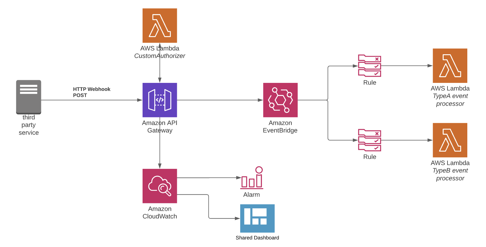

# Webhooks

Every application needs to interact with an ecosystem of 3rd party SaaS providers.
Implementing a webhook HTTP endpoint in your application allows this ecosystem of external applications to notify you. Your application can then react to those notifications and perform tasks accordingly.

## Quick start

```yaml
service: my-app
provider:
  name: aws

webhooks:
  stripe:
    authorizer:
      handler: myAuthorizer.main
    path: /my-webhook-endpoint

plugins:
  - serverless-lift
```

## How it works

The webhook component deploys the following resources:
- an **API Gateway V2 HTTP API and its $default stage** (reused for all webhooks defined in the service file)
- an **Eventbridge EventBus** (reused for all webhooks defined in the service file)
- an **IAM Role** allowing API Gateway to use `PutEvents` API of Eventbridge (reused for all webhooks defined in the service file)
- an **API Gateway V2 route** 
- an **API Gateway V2 integration** defining mappings of parameters between the HTTP request body and the Eventbridge  Event's body
- a **custom Lambda authorizer** to handle signature verification at API Gateway level



## Variables

The webhook component exposes the following variable:

- `busName`: the name of the deployed Eventbridge Bus. The bus is shared among all webhooks instances, the variable is not dependant on a single instance of the component.

This can be used to reference the bus on which notification are published, for example:

```yaml
webhooks:
  stripe:
    # ...

functions:
  myConsumer:
    handler: src/stripeConsumer.handler
    events:
      - eventBridge:
          eventBus: ${webhook:busName}
          pattern:
            source:
              - stripe # filter all events received on stripe webhook
            detail-type:
              - invoice.paid
```

_Note: the `${webhook:busName}` variable will automatically be replaced with a CloudFormation reference to the Eventbridge Bus._

## Configuration reference

### Path

_Required_

```yaml
webhooks:
  stripe:
    path: /my-path
    # ...
```

The endpoint your webhook should be exposed on. Always starts with a `/`.
The final URL for the webhook endpoint will be displayed in the information section when running a `serverless deploy` command and will be `POST https://{id}.execute-api.{region}.amazonaws.com{path}`

### Authorizer

_Conditional - depends on `insecure` value_

```yaml
webhooks:
  stripe:
    authorizer:
      handler: stripe/authorizer.main
    # ...
```
_Note: the Lambda "stripeAuthorizer" function is configured in the `webhooks` component, instead of being defined in the `functions` section._

The only required value is the `handler`: this should point to the code that authenticate 3rd party notification. The handler will receive an event from API Gateway using [payload format v2](https://docs.aws.amazon.com/apigateway/latest/developerguide/http-api-lambda-authorizer.html#http-api-lambda-authorizer.payload-format). The handler [should be written to return the expected simple payload format](https://docs.aws.amazon.com/apigateway/latest/developerguide/http-api-lambda-authorizer.html#http-api-lambda-authorizer.payload-format-response).

```js
const authorizer = (event, context, callback) => {
  callback(null, {
    "isAuthorized": true,
  });
}
```

[All settings allowed for functions](https://www.serverless.com/framework/docs/providers/aws/guide/functions/) can be used under the `authorizer` key. For example:

```yaml
webhooks:
  stripe:
    authorizer:
      handler: stripe/authorizer.main
      environment:
        STRIPE_SECRET: my-secret
    # ...
```

**Lift will automatically configure the function to be triggered by API Gateway.** It is not necessary to define `events` on the function.

### Type

_Optional_
Defaults to `Webhook`.

Can either be a dynamic path selector:
```yaml
webhooks:
  stripe:
    type: $request.body.type
    # ...
```

Or a static string:
```yaml
webhooks:
  stripe:
    type: stripe
    # ...
```

Always favor dynamic path selector to ensure the minimum amount of compute is executed downstream. The list of available dynamic selector is available in [API Gateway documentation](https://docs.aws.amazon.com/apigateway/latest/developerguide/http-api-develop-integrations-aws-services.html#http-api-develop-integrations-aws-services-parameter-mapping).


### Insecure

_Optional_
Defaults to `false`.

When `insecure` is set to `true`, no authorization Lambda is triggered on incoming HTTP request to verify the caller identity.
This setting is not recommended and SHOULD NOT BE USED IN PRODUCTION to avoid _Denial of Wallet attacks_.

```yaml
webhooks:
  stripe:
    insecure: true
    # ...
```
